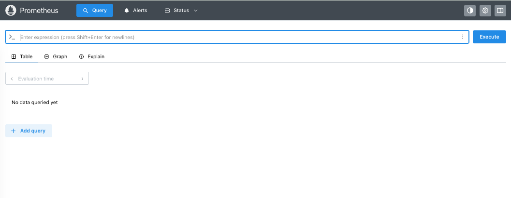
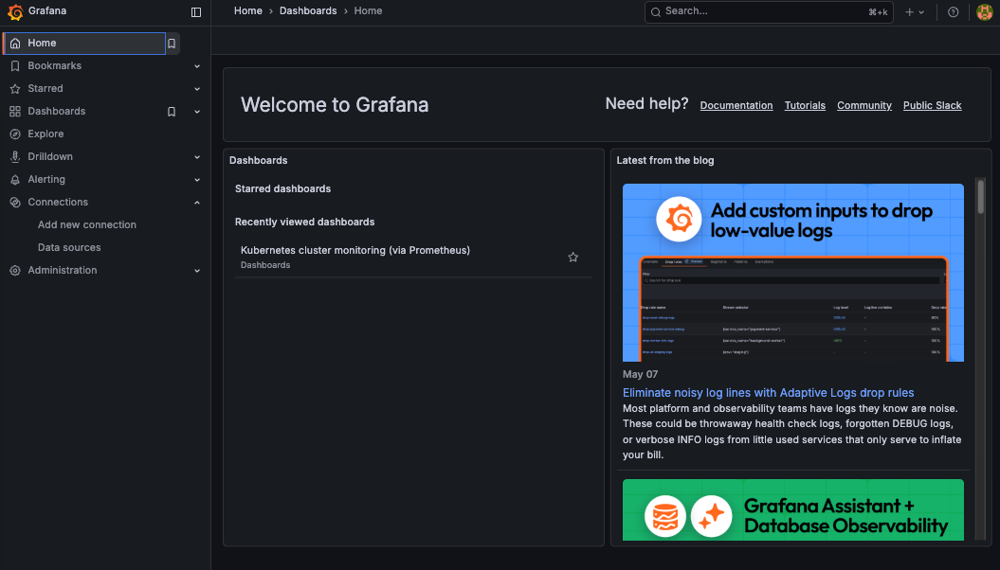

## **Deploy Prometheus and Grafana on Kubernetes using Helm**

The main objective is to demonstrate how to deploy and configure a Kubernetes monitoring stack using:

- **Prometheus** for metrics collection
- **Grafana** for visualization
- Helm for simplified installation and management on Kubernetes.

**Objective**:

- Set up cluster monitoring quickly
- Avoid manual YAML deployments
- Understand how Prometheus and Grafana integrate together
- Visualize Kubernetes metrics through dashboards

### Key Takeaways

- Helm significantly simplifies observability stack deployment in Kubernetes.
- Prometheus + Grafana is one of the most widely used monitoring combinations in cloud-native environments.
- Kubernetes observability is essential for production reliability and troubleshooting.
- Using Helm charts provides scalability, repeatability, and easier upgrades. ([ComputingForGeeks](https://computingforgeeks.com/install-prometheus-grafana-kubernetes/?utm_source=chatgpt.com))

### Pre-requistes

- minikube cluster up and running 
- helm package manager installed


### Starting a minikube cluster

```
# Start the cluster
./runminikube.sh start

# Check the cluster status 
./runminikube.sh status

```

### Installing prometheus server

```
# Create a folder for monitoring
mkdir kube-monitoring
cd kube-monitoring
```
```
# Create a namespace called monitoring
kubectl create namespace monitoring
kubectl get ns
```

```
# Install prometheus using helm
helm install prometheus prompetheus-community/prometheus
helm repo add prometheus-community https://prometheus-community.github.io/helm-charts\nhelm repo update
helm repo list
helm install prometheus prometheus-community/prometheus -n monitoring
```
```
# Verify all the resources for prometheus in monitoring namespace
kubectl get all -n monitoing
kubectl get configmaps -n monitoring
kubectl describe configmaps prometheus-server -n monitoring
kubectl get configmaps -n monitoring
kubectl get secrets -n monitoring
kubectl describe secrets sh.helm.release.v1.prometheus.v1 -n monitoring
kubectl get serviceaccounts -n monitoring
kubectl get clusterrole -n monitoring
kubectl get clusterrolebindings -n monitoring
kubectl get svc -n monitoring
```

```
# Expose prometheus-server service 
kubectl expose service prometheus-server --type=NodePort --target-port=9090 --name=prometheus-server-ext -n monitoring
```
```
# Expose minikube tunnel/proxy for http access
minikube service prometheus-server-ext -n monitoring
```

<!--  -->





### Installing Grafana server

```
# Create/Navigate to folder for monitoring
cd kube-monitoring
```

```
# Install grafana using helm in monitoring namespace 
helm search hub grafana
helm repo add grafana https://grafana.github.io/helm-charts \nhelm repo update
helm repo list
helm install grafana grafana/grafana -n monitoring
```

```
kubectl get secret --namespace monitoring grafana -o jsonpath="{.data.admin-password}" | base64 --decode ; echo
kubectl get service -n monitoring
```

```
# Expose prometheus-server service 
kubectl expose service grafana --type=NodePort --target-port=3000 --name=grafana-ext -n monitoring
```

```
# Creates temporary access tunnel/proxy for minikube for http access
minikube service grafana-ext -n monitoring
```


<!--  -->


### Login to Grafana 

Obtain the password for user 'admin'
```
kubectl get secret --namespace monitoring grafana -o jsonpath="{.data.admin-password}" | ForEach-Object { [System.Text.Encoding]::UTF8.GetString([System.Convert]::FromBase64String($_)) }
```
### Connecting prometheus to Grafana
1. Under the grafana UI, click on Data source under connections
2. Provide the name as prometheus
3. Under server URL, provide the url of the prometheus server - the one provided by when you ran - minikube service prometheus-server-ext -n monitoring
4. Click on Save and test to add the prometheus server to Grafana

### Adding the dashboard

1. In the [grafana-labs](https://grafana.com/grafana/dashboards/315-kubernetes-cluster-monitoring-via-prometheus/), search for **Kubernetes cluster monitoring (via Prometheus)**
2. Copy the Dashboard-Id
3. Under Grafana dashboard click on - Dashboard, click on New > import
4. Under 'Find and import dashboards for common applications..' paste the copied Dashboard-Id and click load
5. Under the 'Select a data source' add the promotheus server

